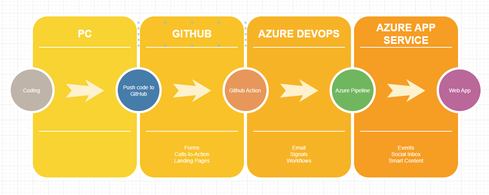
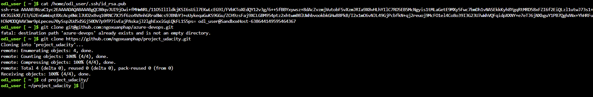
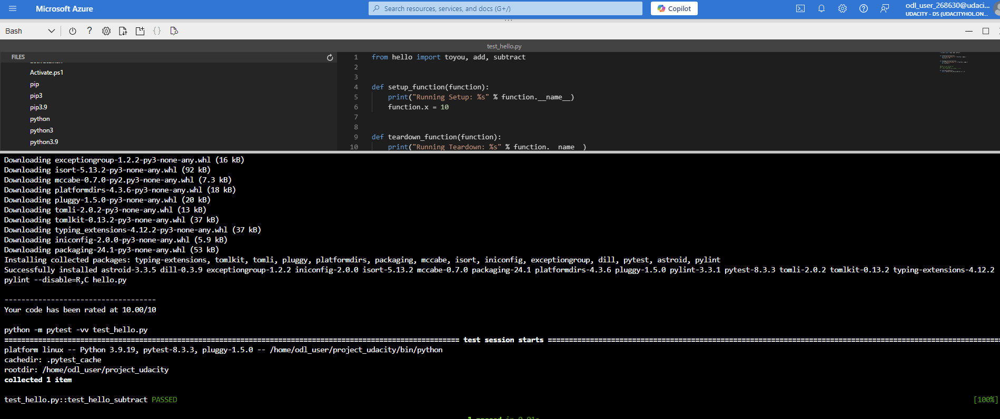
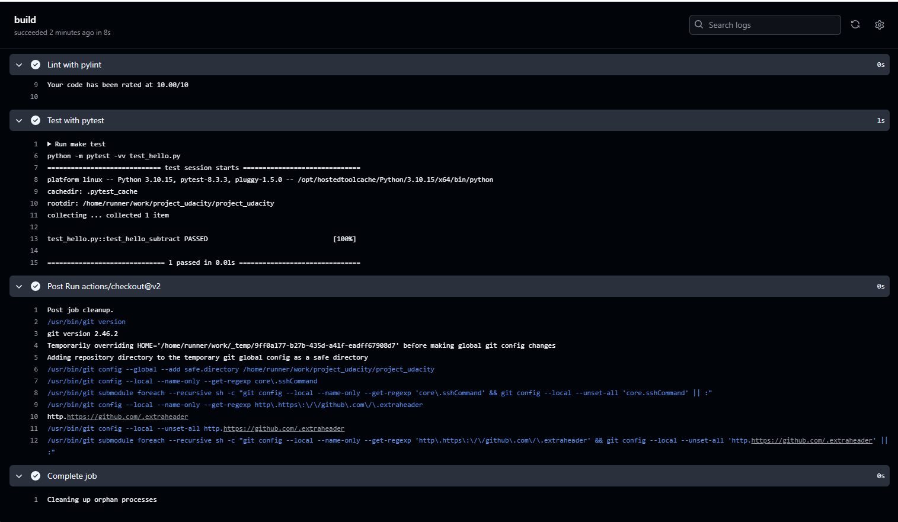
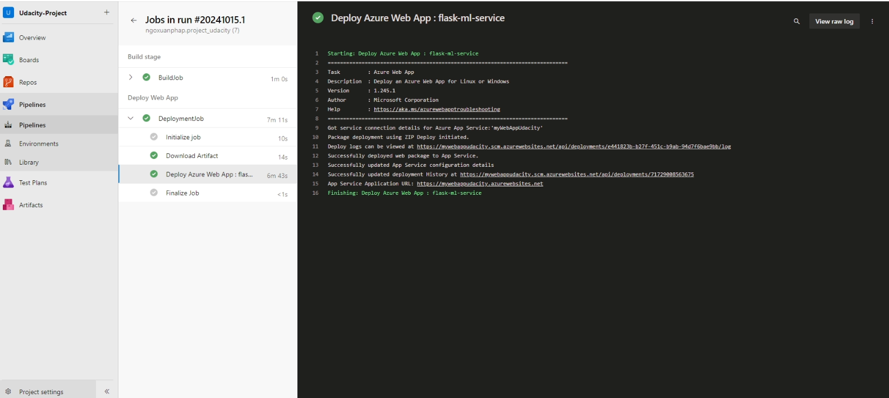
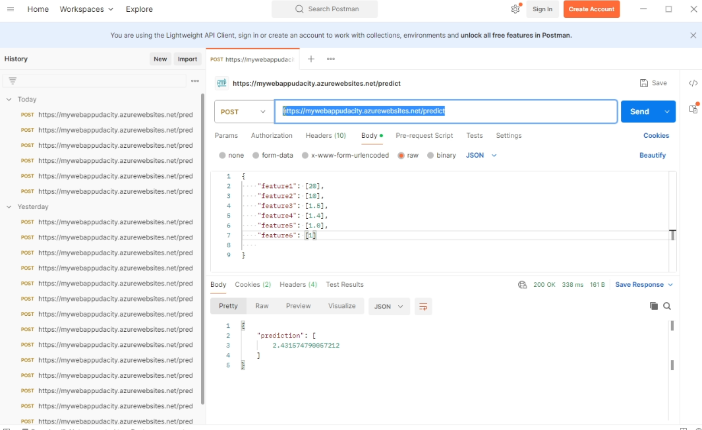
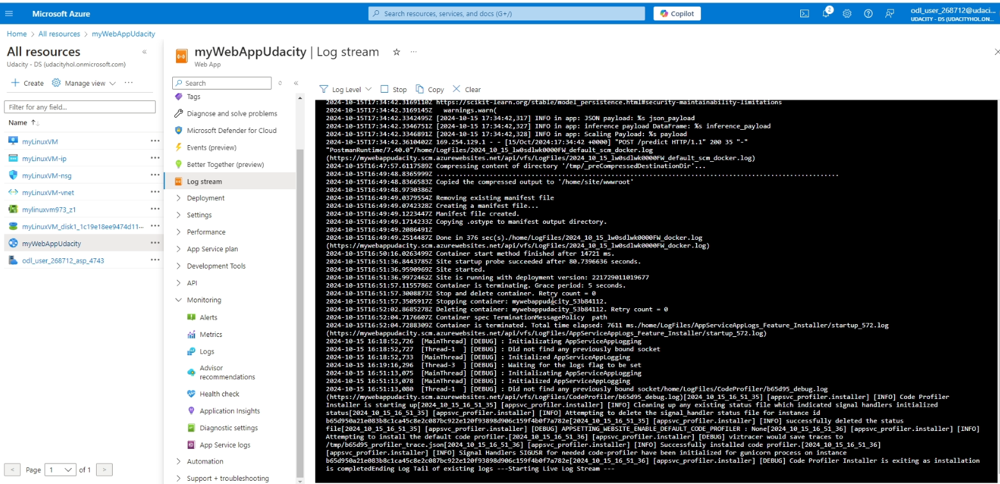

# Overview

This is project CICD use Azure Devops

## Project Plan

* A link to a Trello board for the project
* A link to a spreadsheet that includes the original and final project plan>

## Instructions

* Architectural Diagram

* Project cloned into Azure Cloud Shell

* Passing tests that are displayed after running the `make all` command from the `Makefile`

* Output of a test run

* Successful build and deploy of the project in Azure Pipelines. 

* Output

* Successful prediction from deployed flask app in Azure Cloud Shell and test

* Output of streamed log files 

## Enhancements
To improve the this project, I thinks:
- Use Docker
- Coding Microservices
## Demo 

Link Demo : https://www.youtube.com/watch?v=2ltw53Fe0Eo

